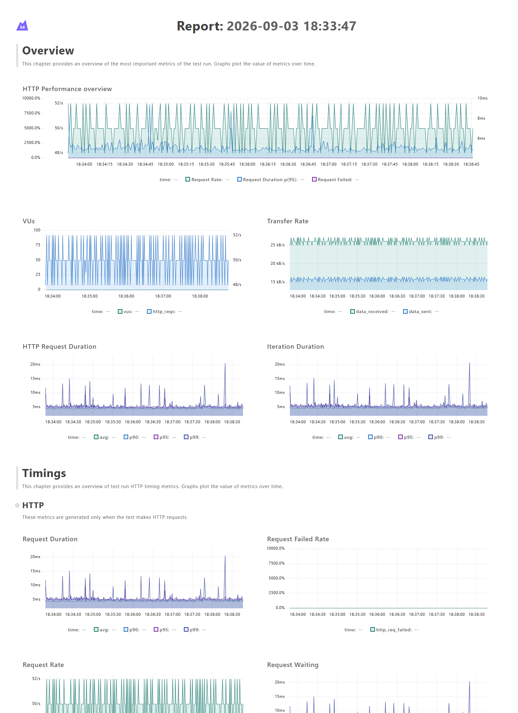

# V1 Remote Evaluation Baseline — 2026-09-03



## Result

The V1 remote evaluation path completed 15,000 scheduled evaluations over five
minutes at a constant target rate of 50 evaluations per second. No iterations
were interrupted. The dashboard shows the request rate holding close to 50/s,
no HTTP failure signal, and p95 request latency generally remaining below 10 ms
with brief higher spikes.

This is a correctness and stability baseline at a modest load. It is not a
maximum-throughput result.

## Path under test

```text
k6
 -> Nginx
 -> Django REST Framework
 -> PostgreSQL flag and targeting-rule reads
 -> targeting evaluation
 -> SHA-256 stable rollout bucket
 -> synchronous PostgreSQL audit insert
 -> JSON response
```

Every request used a distinct synthetic user ID, `premium: true`, and
`country: "US"`. This caused the seeded targeting rule to participate while the
25% rollout produced both enabled and disabled decisions. Synthetic users were
not persisted as user records; each request did create an evaluation audit row.

## Environment

- Application commit: `8606f3a`
- Equivalent load-test definition: `aada6a5`
- Load generator: k6 2.2.0
- Runtime: Docker Desktop through WSL
- Docker Engine: 29.7.2
- CPU exposed to WSL: Intel Core i9-14900F, 32 logical CPUs
- Memory exposed to WSL: 15 GiB
- Gunicorn workers: 3
- Target rate: 50 evaluations/second
- Duration: 5 minutes

## Artifacts

- [Open or download the self-contained interactive HTML report](report.html)
- [View the load-test source](../../../load-tests/k6/evaluate.js)
- [Read the load-testing instructions](../../LOAD_TESTING.md)

## Methodology note

The live-dashboard connection kept the temporary k6 container open after all
15,000 scheduled iterations completed, because this run began before the
explicit `K6_LINGER=false` setting was added. The runner was stopped after
workload completion, and the time-series report was preserved. Later runs have
the explicit non-lingering setting.

Future benchmark claims should preserve the final k6 summary as structured data
and record Docker CPU and memory limits in addition to the host environment.
