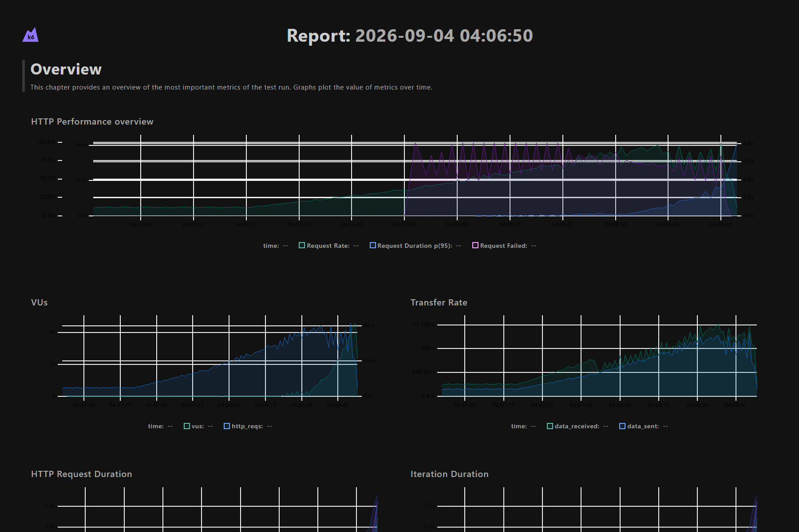
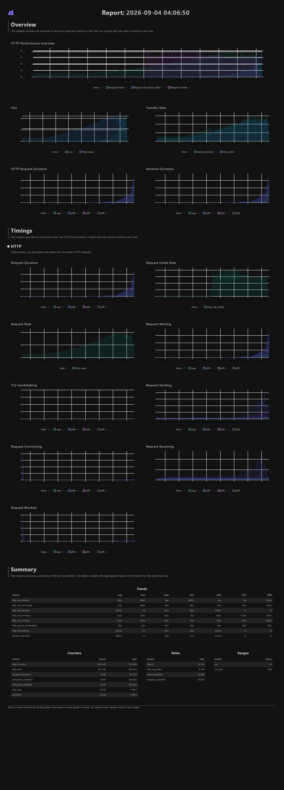

# Cached + Queued-Audit Two-Minute Ramp — 2026-09-04



## Result

This run tested the first optimized evaluation architecture: six synchronous
Gunicorn workers, Redis-cached flag configuration, and durable asynchronous
audit delivery through Celery and Redis. Offered load ramped from 500 to 5,000
evaluations/second over two minutes.

| Measurement | Result |
| --- | ---: |
| Completed HTTP attempts | 220,611 |
| Successful evaluations | 92,890 |
| Average completed HTTP rate | 1,784.03/s |
| HTTP 200 responses | 92,890 |
| HTTP 502 responses | 127,721 |
| Dropped iterations | 11,845 |
| Median request duration | 6.32 ms |
| Overall p95 request duration | 1.75 s |
| Correct rollout cohort | 24.90% enabled |
| Targeting participation | 100% |

## Interpretation

The endpoint handled the 500 and 1,500 evaluations/second regions without the
early application queue collapse seen in the original implementation. During
the ramp toward 3,000/second, Nginx began returning 502 responses with:

```text
connect() failed (99: Address not available) while connecting to upstream
```

Nginx currently creates a new TCP connection to Gunicorn for each proxied
request. The accumulated short-lived connections exhausted locally available
source ports. Consequently, this test found a reverse-proxy connection-reuse
bottleneck; it did not establish the optimized Django endpoint's maximum
sustainable throughput.

The audit queue temporarily accumulated a backlog and subsequently drained to
zero, confirming that audit persistence remained asynchronous during the run.

## Test shape

| Time | Offered-load target |
| --- | ---: |
| 0–30 seconds | 500/s |
| 30–60 seconds | Ramp to 1,500/s |
| 60–90 seconds | Ramp to 3,000/s |
| 90–120 seconds | Ramp to 5,000/s |

## Artifacts

- [Open the interactive dashboard now](https://rawcdn.githack.com/Bigblue115692/feature-flag-platform-v1/7d142be4e6906ee0c901ee0b886c7822269bdcf5/docs/benchmarks/2026-09-04-cache-queue-2m/report.html) (the preview host shows a one-time safety confirmation)
- [GitHub Pages dashboard](https://bigblue115692.github.io/feature-flag-platform-v1/benchmarks/2026-09-04-cache-queue-2m/report.html) (available after Pages is enabled)
- [Download the self-contained report](report.html)
- [View the dark overview](overview-dark.png)
- [View the full dark dashboard](full-report-dark.png)
- [View the exact k6 scenario](../../../load-tests/k6/throughput-2m.js)


