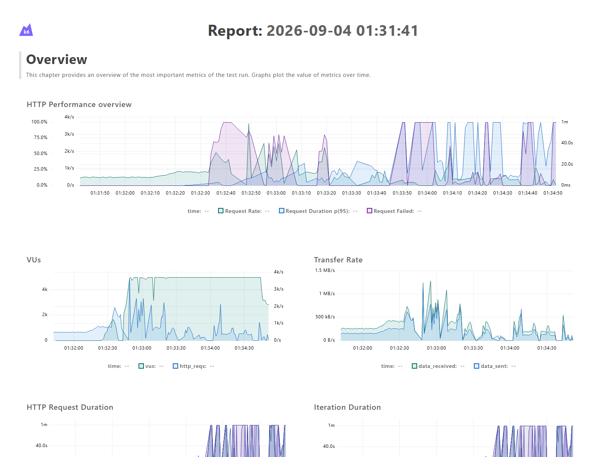
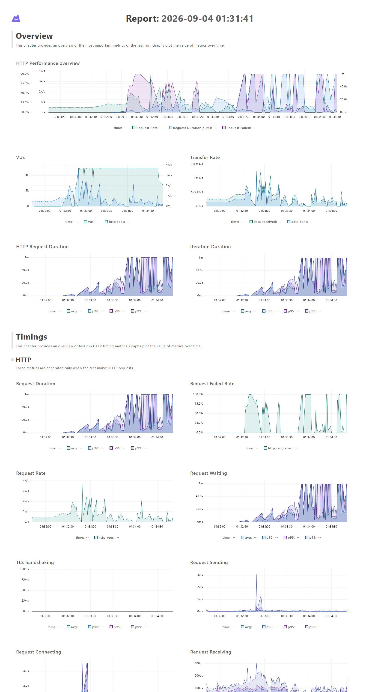

# V1 No-Audit Throughput Comparison — 2026-09-04



## Experiment

This run repeated the same 500-to-10,000 evaluations/second arrival-rate ramp
as the [audited V1 throughput test](../2026-09-04-throughput-ramp/README.md),
but disabled per-evaluation PostgreSQL audit inserts. Administrative audit
events for flag creation, updates, and deletion remain enabled.

The purpose was bottleneck isolation, not a production configuration
recommendation. Evaluation analytics would need a durable asynchronous pipeline
before per-evaluation auditing could safely remain disabled in production.

## Comparison

| Measurement | Audited run | No-audit run | Difference |
| --- | ---: | ---: | ---: |
| Average completed HTTP rate | 449.84/s | 561.65/s | +24.9% |
| Successful evaluations | 64,247 | 77,291 | +20.3% |
| Average overloaded latency | 6.44s | 4.94s | -23.3% |
| Overall p95 latency | 21.75s | 20.90s | -3.9% |
| Dropped iterations | 594,677 | 573,249 | -3.6% |
| HTTP failure rate | 24.83% | 27.57% | +2.74 points |

The higher failure percentage does not mean audit removal made individual
requests less reliable. With less work per request, k6 admitted and completed
more requests before the deliberately extreme overload stages. Both runs were
pushed far past saturation, so whole-run failure percentages are not a
sustainable-capacity measurement.

## Interpretation

Removing synchronous audit inserts improved completed throughput by about 25%
and reduced average latency under overload. It did not eliminate saturation.
The endpoint still reads the flag and targeting rules from PostgreSQL for every
evaluation and is served by three synchronous Gunicorn workers. Those are the
next bottlenecks to isolate.

The no-audit run began queueing around the 1,100 requested evaluations/second
region and reached the 5,000-VU test ceiling during the ramp toward 3,000/second.
A narrower constant-rate test is required before claiming a precise sustainable
capacity.



## Configuration

`EVALUATION_AUDIT_ENABLED` controls only evaluation audit events and defaults to
enabled. The benchmark ran with:

```dotenv
EVALUATION_AUDIT_ENABLED=0
```

The backend test suite verifies both the default audited behavior and the
explicit no-audit behavior.

## Artifacts

- [Open or download the self-contained interactive report](report.html)
- [View the focused overview image](overview.png)
- [View the full dashboard image](full-report.png)
- [View the throughput-ramp test](../../../load-tests/k6/throughput.js)

