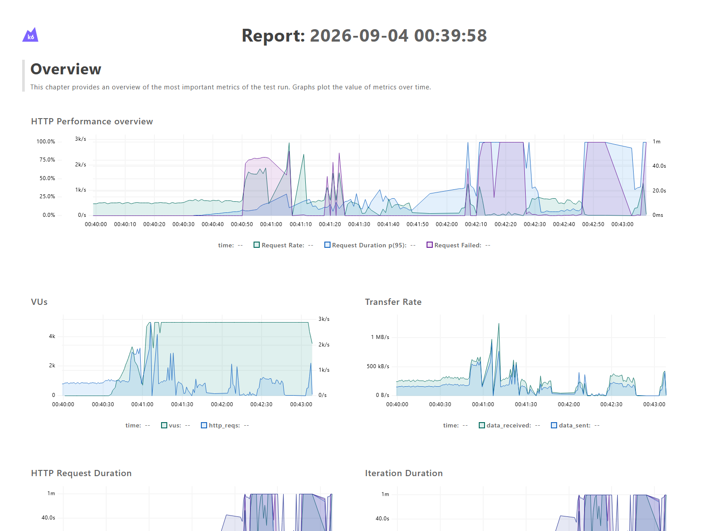
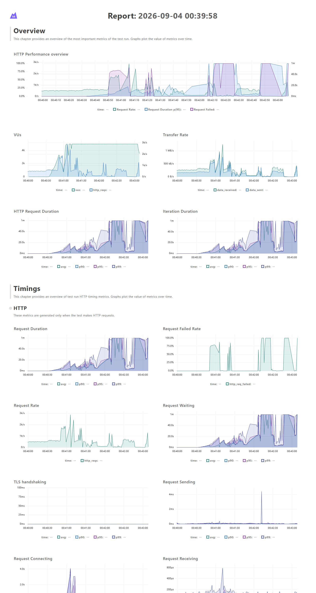

# V1 Maximum-Throughput Ramp — 2026-09-04

## Result

This test intentionally increased offered load from 500 to 10,000 remote
evaluations per second to expose the current implementation's saturation
behavior. It did **not** achieve 10,000 successful evaluations per second.

- Clearly sustainable observed rate: approximately 500 evaluations/second
- Borderline region requiring a narrower confirmation test: 600–700/second
- Queueing became severe above approximately 850 requested/second
- Peak offered load: 10,000/second
- Average completed request rate across the overloaded run: 449.84/second
- Completed HTTP requests: 85,476
- Successful evaluations: 64,247
- Timed-out requests: 21,229 (24.83%)
- Dropped iterations: 594,677
- Overall p95 latency: 21.75 seconds
- Correct rollout result among successful evaluations: 24.88%
- Successful evaluations with targeting participation: 100%

The sustained-capacity claim is deliberately conservative. A follow-up test
holding several rates between 400 and 800/second is needed to identify the
precise service-level boundary.

## Reading the graphs

The request-rate line shows completed throughput, not merely attempted load.
The VU graph reaching 5,000 indicates requests accumulated while waiting for
responses. The rising duration and failure series show the application
transitioning from healthy operation to queueing and then request timeouts.

## Test profile

The k6 arrival rate used 30-second stages of 500, 1,500, 3,000, 5,000, 7,500,
and 10,000 requested evaluations per second, with up to 5,000 virtual users.
The request path included Nginx, Django REST Framework, PostgreSQL reads,
targeting, deterministic SHA-256 rollout bucketing, and a synchronous audit
insert. Each successful request used a distinct synthetic user ID and created
an evaluation audit row, but did not create a persisted user record.

## Artifacts

- [Open or download the self-contained interactive report](report.html)
- [View the focused overview image](overview.png)
- [View the full dashboard image](full-report.png)
- [View the reusable throughput-ramp test](../../../load-tests/k6/throughput.js)

